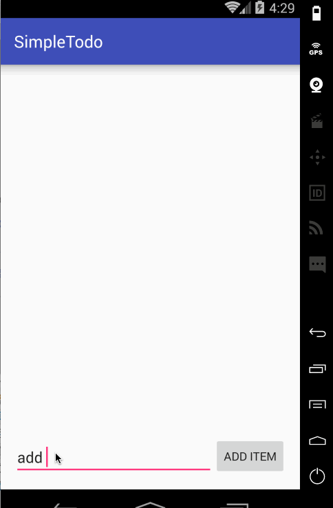

# Codepath Android Bootcamp

This is an Android demo application for a simple Todo list. See the [Android Pre-work: Todo App](http://courses.codepath.com/snippets/intro_to_android/prework) for requirements and specification.

Completed user stories:

 * [x] Required: User can add new items to the list.
 * [x] Required: User can delete an existing item.
 * [x] Required: User can edit an existing item.
 

Walkthrough of all user stories:

GIF created with [LiceCap](http://www.cockos.com/licecap/).
